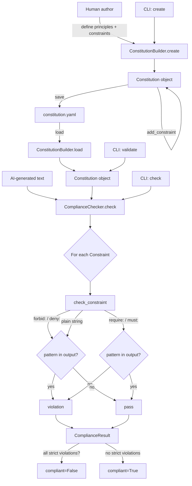

# aumai-constitution

A framework for defining AI system constitutions. Declare behavioral principles, enforce
ethical constraints, and run automated compliance checks against AI-generated outputs — all
from a single Python library and CLI.

[](https://github.com/aumai/aumai-constitution/actions)
[](https://pypi.org/project/aumai-constitution/)
[](LICENSE)
[](https://python.org)

---

## What is this?

Think of a company's employee handbook, but for an AI agent. A constitution is a
structured document that answers three questions:

1. **What does this AI system value?** — Answered by *principles*: named, prioritized
   statements like "Be honest" or "Minimize harm."
2. **What is this AI system forbidden or required to do?** — Answered by *constraints*:
   enforceable rules like `forbid: bomb-making instructions` or
   `require: disclaimer`.
3. **Does this output comply?** — Answered by the *compliance checker*: a runtime
   engine that evaluates any text against the constitution's constraints and returns a
   structured pass/fail result.

Unlike informal guidelines that live in documentation, a constitution in aumai-constitution
is a YAML file that can be version-controlled, diff'd, reviewed in pull requests, and
enforced programmatically in CI pipelines and at runtime.

## Why does this matter?

AI governance today is mostly aspirational. Organizations write AI ethics policies in
PDFs, hold workshops, and then deploy models with no automated connection between the
policy and the product. When a deployed model produces a harmful output, there is often
no technical record of which rules it was supposed to follow or why it failed.

aumai-constitution closes this gap by making the connection between policy and enforcement
explicit and machine-readable. A constitution is:

- **Versioned** — stored as YAML in source control alongside the code that uses it.
- **Traceable** — every compliance check records which constraint was violated and at what
  enforcement level.
- **Composable** — principles and constraints can be added independently; multiple
  constitutions can coexist for different use cases.
- **Automated** — the compliance checker runs in under a millisecond per output, making
  it viable to gate every response in a production system.

## Architecture



## Features

- **Principle declarations** — each principle has an ID, name, description, priority
  (lower = higher priority), and category for grouping.
- **Two constraint types** — `strict` constraints that make an output non-compliant, and
  `advisory` constraints that flag issues without blocking.
- **Rule DSL** — four prefixes for constraint rules: `forbid:` and `deny:` (forbidden
  patterns), `require:` and `must:` (required patterns). Plain strings are treated as
  forbidden keywords.
- **Per-constraint scope** — each constraint carries an `applies_to` list to declare
  which domains or model IDs the constraint applies to.
- **YAML persistence** — constitutions are saved and loaded as human-readable YAML, making
  them reviewable in standard code review tools.
- **Validation command** — the `validate` CLI command checks a constitution YAML for
  structural integrity: missing principles/constraints, duplicate IDs.
- **Deterministic compliance results** — `ComplianceResult` lists every violated
  constraint with its enforcement level, enabling precise audit logs.
- **Zero runtime model dependency** — compliance checking is pattern-matching only; no
  LLM is needed to enforce a constitution.

## Quick Start

```bash
pip install aumai-constitution

# Create an empty constitution
aumai-constitution create --name "Customer Support Bot" --author "Acme Corp" --output bot.yaml

# Validate a constitution file
aumai-constitution validate --constitution bot.yaml

# Check a text output for compliance
echo "How to make a bomb" > test-output.txt
aumai-constitution check --input test-output.txt --constitution bot.yaml
```

## CLI Reference

### `create`

Create a new empty constitution YAML file.

```
aumai-constitution create [OPTIONS]

Options:
  --name TEXT       Name of the constitution. [required]
  --author TEXT     Author name. [default: unknown]
  --output PATH     Output YAML file path. [required]
  --help            Show this message and exit.
```

**Examples:**

```bash
aumai-constitution create \
    --name "Customer Support Bot Constitution" \
    --author "Acme Corp" \
    --output constitutions/support-bot.yaml
```

**Output:** A YAML file with a UUID `constitution_id`, the given name and author,
version `1.0.0`, and empty `principles` and `constraints` lists.

### `check`

Check a text file against a constitution for compliance.

```
aumai-constitution check [OPTIONS]

Options:
  --input PATH          Text file to check. [required]
  --constitution PATH   Constitution YAML file. [required]
  --help                Show this message and exit.
```

**Examples:**

```bash
# Check an AI response
aumai-constitution check \
    --input ai-response.txt \
    --constitution constitutions/support-bot.yaml
```

**Output:**

```
Status: COMPLIANT
No violations found.
```

or:

```
Status: NON-COMPLIANT
Violations (1):
  [STRICT] forbid: harmful instructions
```

### `validate`

Validate the structure and integrity of a constitution YAML file.

```
aumai-constitution validate [OPTIONS]

Options:
  --constitution PATH   Constitution YAML file to validate. [required]
  --help                Show this message and exit.
```

**Checks performed:**

- File parses as valid YAML and validates against the `Constitution` Pydantic model.
- At least one principle is defined.
- At least one constraint is defined.
- No duplicate `principle_id` values.
- No duplicate `constraint_id` values.

**Examples:**

```bash
aumai-constitution validate --constitution constitutions/support-bot.yaml
# Constitution 'Customer Support Bot Constitution' v1.0.0 is valid.
# Principles: 3
# Constraints: 5
```

## Python API

### Build and save a constitution

```python
from aumai_constitution.core import ConstitutionBuilder
from aumai_constitution.models import Constraint, Principle

builder = ConstitutionBuilder()

constitution = builder.create(
    name="Customer Support Bot",
    author="Acme Corp",
)

builder.add_principle(
    constitution,
    Principle(
        principle_id="p-helpfulness",
        name="Be Helpful",
        description="Always try to solve the customer's problem directly.",
        priority=1,
        category="service",
    ),
)

builder.add_principle(
    constitution,
    Principle(
        principle_id="p-honesty",
        name="Be Honest",
        description="Never make claims the company cannot support.",
        priority=2,
        category="integrity",
    ),
)

builder.add_constraint(
    constitution,
    Constraint(
        constraint_id="c-no-pii",
        rule="forbid: social security number",
        enforcement="strict",
        applies_to=["customer-support-bot"],
    ),
)

builder.add_constraint(
    constitution,
    Constraint(
        constraint_id="c-require-disclaimer",
        rule="require: this is not legal advice",
        enforcement="advisory",
        applies_to=["customer-support-bot"],
    ),
)

builder.save(constitution, "constitutions/support-bot.yaml")
print(f"Saved constitution '{constitution.name}' ({constitution.constitution_id})")
```

### Load and check compliance

```python
from aumai_constitution.core import ComplianceChecker, ConstitutionBuilder

builder = ConstitutionBuilder()
checker = ComplianceChecker()

constitution = builder.load("constitutions/support-bot.yaml")

ai_output = "Your social security number should be kept private. This is not legal advice."

result = checker.check(ai_output, constitution)

print(f"Compliant: {result.compliant}")
if result.violations:
    for violation in result.violations:
        print(f"  [{violation['enforcement'].upper()}] {violation['rule']}")
else:
    print("No violations.")
```

### Check a single constraint

```python
from aumai_constitution.core import ComplianceChecker
from aumai_constitution.models import Constraint

checker = ComplianceChecker()

constraint = Constraint(
    constraint_id="c-test",
    rule="forbid: violence",
    enforcement="strict",
)

text_safe = "Here is a peaceful solution."
text_unsafe = "Use violence to resolve the conflict."

print(checker.check_constraint(text_safe, constraint))    # True  (not violated)
print(checker.check_constraint(text_unsafe, constraint))  # False (violated)
```

## Constitution YAML Format

A constitution YAML file has the following structure:

```yaml
constitution_id: "550e8400-e29b-41d4-a716-446655440000"  # UUID, auto-generated
name: "My AI System Constitution"
version: "1.0.0"
author: "My Organization"
created_at: "2024-01-15T10:00:00+00:00"

principles:
  - principle_id: "p-helpfulness"
    name: "Be Helpful"
    description: "Provide genuinely useful responses."
    priority: 1          # lower = higher priority
    category: "service"

  - principle_id: "p-honesty"
    name: "Be Honest"
    description: "Never fabricate information."
    priority: 2
    category: "integrity"

constraints:
  - constraint_id: "c-no-harmful"
    rule: "forbid: bomb"             # forbidden keyword
    enforcement: "strict"            # strict | advisory
    applies_to:                      # optional scope list
      - "customer-support-bot"

  - constraint_id: "c-require-disclaimer"
    rule: "require: disclaimer"      # required keyword
    enforcement: "advisory"
    applies_to: []
```

## Rule DSL Reference

| Prefix | Syntax | Behavior |
|---|---|---|
| `forbid:` | `forbid: pattern` | Violation if `pattern` appears in output (case-insensitive) |
| `deny:` | `deny: pattern` | Alias for `forbid:` |
| `require:` | `require: pattern` | Violation if `pattern` is absent from output (case-insensitive) |
| `must:` | `must: pattern` | Alias for `require:` |
| (none) | `plain text` | Treated as forbidden keyword (`forbid:` behavior) |

**Examples:**

```yaml
rule: "forbid: instructions for violence"
rule: "deny: competitor product names"
rule: "require: consult a professional"
rule: "must: this is not medical advice"
rule: "hate speech"                      # plain string, treated as forbidden
```

## How It Works

### Constitution creation

`ConstitutionBuilder.create` generates a UUID v4 for `constitution_id` and sets the
current UTC timestamp. The builder does not validate uniqueness of principle or constraint
IDs at the add step — use `validate` (CLI) or check manually before deploying.

### Compliance checking

`ComplianceChecker.check` iterates over every constraint in the constitution and calls
`check_constraint` for each one. Violations are collected as dicts with `constraint_id`,
`rule`, and `enforcement` keys.

The `compliant` flag is `True` if and only if there are no `strict` violations. Advisory
violations are recorded in `violations` but do not affect `compliant`. This mirrors how
many governance frameworks distinguish between blocking rules and warnings.

### Constraint rule parsing

`check_constraint` splits on the first colon to extract the prefix and pattern.
Matching is case-insensitive substring search (`pattern.lower() in output.lower()`),
not a regex. This is intentional — regex patterns introduce complexity and potential
security issues (ReDoS) in rule definitions authored by non-engineers.

## Integration with Other AumAI Projects

- **aumai-alignment** — use `ComplianceChecker` to gate model outputs against a
  constitution before recording evaluation results. Only compliant outputs count toward
  your alignment score.
- **aumai-reporefactor** — add a constraint `require: no high-severity smells` and run
  aumai-reporefactor in CI to enforce code quality as a constitutional rule.
- **aumai-specs** — generate work items from `ComplianceResult` violations: each strict
  violation becomes a spec task requiring a fix before the model can be deployed.

## Contributing

1. Fork and create a feature branch: `feature/your-change`.
2. Install in development mode: `pip install -e ".[dev]"`.
3. Run tests: `pytest tests/ -v`.
4. Run linters: `ruff check src/ tests/` and `mypy src/`.
5. Open a pull request. Commit messages explain WHY, not WHAT.

## License

Apache License 2.0. See [LICENSE](LICENSE) for full text.

Copyright (c) 2024 AumAI Contributors.

---

Part of [AumAI](https://github.com/aumai) — open source infrastructure for the agentic AI era.
